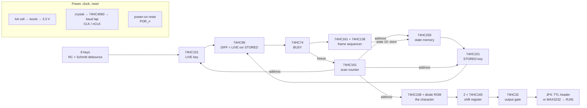
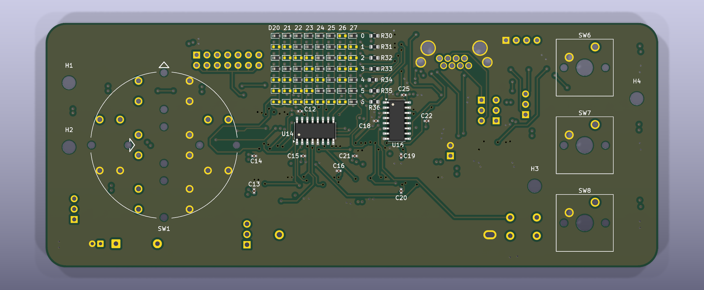
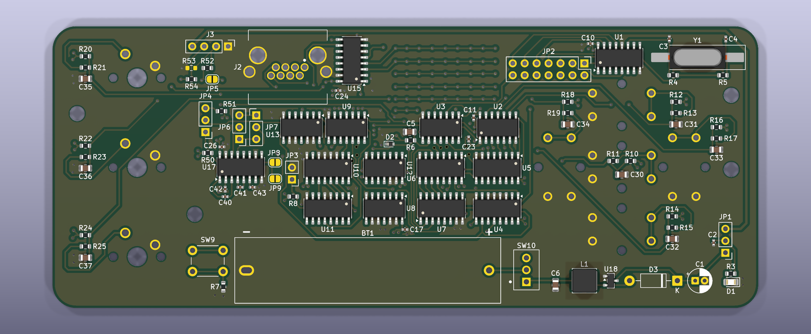
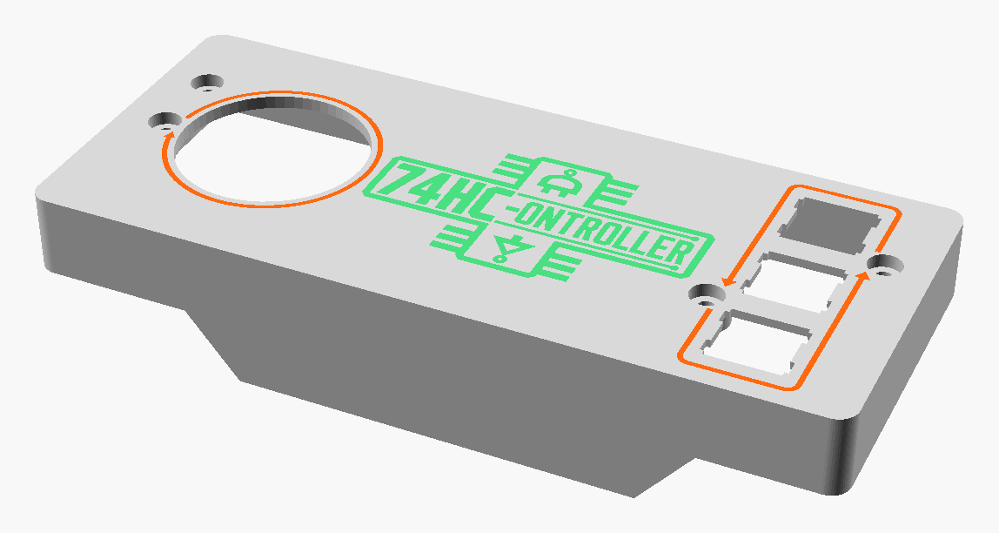
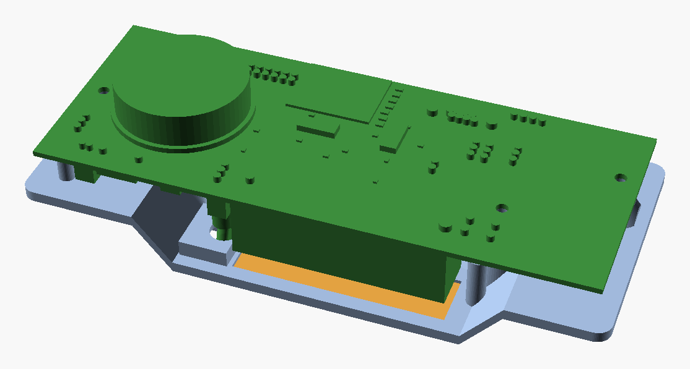
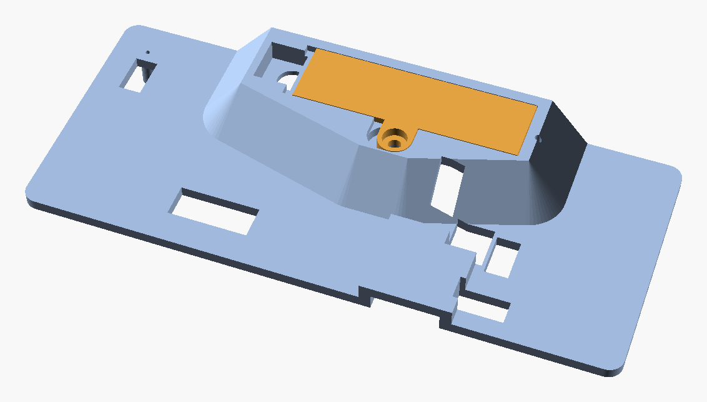
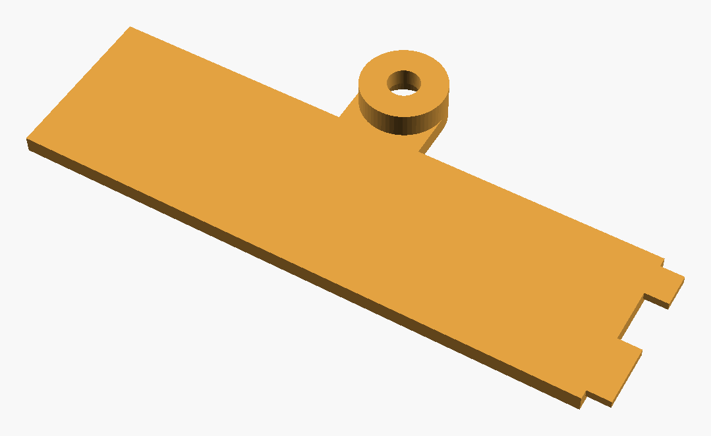

<p align="center">
  
</p>

# 74HC-ontroller

**A game controller built entirely from discrete 74HC logic.** Eight keys, a
diode ROM for a character table, and a real 8-N-1 serial frame out of an RJ45
console port — no microcontroller, no FPGA, no firmware, nothing programmable
anywhere on the board.

## Preface

This project started as an idea for a novel, old-school game controller to
plug into a MikroTik RB4011 that I own and am turning into a gaming console.
The RB4011 already has what a console needs to hear a controller — a serial
console port on an RJ45 jack — so the controller only has to do one thing:
turn a button press into a character on that line.

The twist is *how*. Instead of a microcontroller running a few lines of code,
every step — watching the buttons, noticing a change, looking up the
character, and shifting it out bit by bit at 115200 baud — is done by
sixteen logic chips from the 74HC family, the kind you would find in a 1980s
computer, plus one RS-232 line driver. Change the character a button sends by
moving a diode.

| | |
|---|---|
| Keys | 5-way navigation cluster + 3 Cherry MX switches |
| Output | 8-N-1 serial, 115200 baud by default, as RS-232 on an RJ45 (Cisco console pinout) or 3.3 V TTL on a header |
| Logic | 16 × 74HC-series ICs + a MAX3232 RS-232 transceiver |
| Key map | an 8 × 7 diode ROM — 56 positions, a diode wherever a bit is 1 |
| Power | one AA cell, boosted to 3.3 V; ~1.3 mA, roughly four weeks of continuous use |
| Board | 150 × 60 mm, 6 layers, 1.6 mm |
| Case | 3D-printed, three colours, sliding battery door |

---

## Contents

1. [How it works — the big picture](#1-how-it-works--the-big-picture)
2. [The pipeline, stage by stage](#2-the-pipeline-stage-by-stage)
3. [Putting it together: the life of a key press](#3-putting-it-together-the-life-of-a-key-press)
4. [What you can configure](#4-what-you-can-configure)
5. [Using it with a MikroTik console](#5-using-it-with-a-mikrotik-console)
6. [The hardware](#6-the-hardware)
7. [The case](#7-the-case)
8. [Building one](#8-building-one)
9. [Repository layout](#9-repository-layout)

---

## 1. How it works — the big picture

A microcontroller would handle a key press with a loop and an interrupt. This
board does the same job as a small **pipeline of hardware stages**, each on
its own schematic sheet, each handing a signal to the next:



The idea in one paragraph: a counter **scans** the eight keys one at a time,
comparing each key's **live** state with the state the board **remembers**.
When they differ, a key has changed. The board then **freezes the scan** on
that key, uses the key's number to select a row of the **diode ROM** — which
presents that key's character — **shifts** the character out as a serial
frame, **stores** the key's new state so the difference disappears, and
**resumes** scanning. Everything is clocked by the baud-rate clock, so the
whole machine runs in lock-step with the serial line.

---

## 2. The pipeline, stage by stage

The schematic is split into seven sheets, in the order a signal travels
through them. A PDF of the whole schematic is in
[`docs/schematic.pdf`](docs/schematic.pdf).

### Stage 1 — Power, clock and reset *(sheet: Power, Clock, Reset)*

Everything else depends on three things from this sheet.

**Power.** One AA cell goes through the power switch (SW10) into an
**ME2108A33 boost converter** (U18, with L1, D3 and C1), which makes the
board's single **3.3 V** rail. It starts from a 0.9 V cell and keeps
regulating down to 0.45 V, so the battery is used to the end. JP1 can instead
take power from the TTL header. D1 is the power LED.

**Clock.** A **3.6864 MHz crystal** drives the oscillator inside a
**74HC4060** (U1), which also divides the frequency by powers of two. Jumper
**JP2** picks one of those outputs as the bit clock, `CLK` — by default
3.6864 MHz ÷ 32 = exactly **115200 Hz**, one tick per serial bit. A Schmitt
inverter makes `nCLK`, its opposite edge, which the control logic uses.

**Reset.** An RC network (R6, C5) and two Schmitt inverters hold `POR_n` low
for about 87 ms at switch-on, which clears the state memory, the scanner and
the BUSY flag — so the controller never sends a burst of junk characters when
it powers up. SW9 is a manual reset button.

### Stage 2 — Keys and debounce *(sheet: Keys and Debounce)*

Each of the eight keys has its own complete **debounce cell**: a 10 kΩ
pull-up, a 1 kΩ series resistor, a 1 µF capacitor to ground and a **74HC14
Schmitt-trigger** inverter.

```
+3V3 ──[10k]──┬──[1k]── switch ── GND
              │
             1µF          ──► 74HC14 ──► KEYn  (high while pressed)
              │
             GND
```

The cell is deliberately **asymmetric**: pressing discharges the capacitor
through 1 kΩ (a ~1.7 ms response), releasing recharges it through 10 kΩ
(~7.4 ms). The slow edges swallow contact bounce, and the Schmitt trigger
turns the slow analogue ramp into one clean logic edge.

The keys are **KEY0–KEY4**: the five directions of an SJMS 5-way navigation
cluster (SW1, one package) — **KEY5–KEY7**: three Cherry MX switches (SW6–SW8).

### Stage 3 — Scanner and memory *(sheet: Scanner and Memory)*

This stage decides *whether* anything needs sending.

* A **74HC161 counter** (U4) steps a 3-bit address, `ADDR0–2`, through the
  eight keys, one key per clock tick. A full sweep takes eight bit times.
* A **74HC151 multiplexer** (U5) reads the addressed key's live state: `LIVE`.
* A **74HC259 addressable latch** (U6) is the board's memory — eight bits
  holding the last state that was *reported* for each key.
* A second **74HC151** (U7) reads the remembered state of the same key:
  `STORED`. (The '259 has no read-back port of its own, so this second
  multiplexer is essential.)
* A **74HC86 XOR** gate compares the two: `DIFF = LIVE xor STORED`.

`DIFF` goes high exactly when the key under the scanner has changed since it
was last reported. That is the only event this whole machine reacts to.

### Stage 4 — Transmit sequencer *(sheet: Transmit Sequencer)*

This stage runs a transmission once `DIFF` says there is something to send.

* **`BUSY`** — a 74HC74 flip-flop (U9A) captures `DIFF` on the `nCLK` edge.
  While `BUSY` is high, the scan counter is **frozen** through its count
  enables. The clock itself is never gated, so there are no glitches.
* A second **74HC161** (U10) counts the bit times of the frame, and a
  **74HC138** decoder (U11) picks out two moments from that count:
  * **State 10** — the frame has finished, so it pulses the 74HC259's write
    enable. The key's new state is stored, `DIFF` falls, and on the next edge
    `BUSY` clears itself and the scanner moves on.
  * **State 11** — a lock-up escape. If `DIFF` somehow failed to clear, the
    second flip-flop (U9B) forces `BUSY` off, so the controller can never
    freeze for good.

The whole event takes **11 bit times**: 10 for the frame, 1 to store and
resume. That's about 95 µs at 115200 baud.

### Stage 5 — ASCII diode ROM *(sheet: ASCII Diode ROM)*

This stage decides *what* gets sent. It is a real read-only memory, built
from diodes:

* A **74HC238 decoder** (U14) takes the frozen key address and drives exactly
  one of eight **rows** high — one row per key.
* Seven **columns** run across the rows, one per bit of the ASCII code
  (b0–b6), each held low by a 15 kΩ pull-down (R30–R36).
* Where a bit should be 1, a **diode** connects that key's row to that bit's
  column (anode to the row, cathode to the column). Driving the row pulls
  those columns high; the rest stay low.

Of the 56 positions (8 keys × 7 bits), **27 are fitted** for the default key
map. The decoder is only enabled while `DIFF` is high, so the ROM draws
nothing at rest.

### Stage 6 — UART shift register *(sheet: UART Shift Register)*

Two **74HC165 shift registers** (U15, U16) are chained into a 16-bit
register that holds the whole frame:

| Frame bit | Comes from |
|---|---|
| start (0) | tied to ground |
| b0 … b6 | the ROM columns |
| bit 7 | make/break flag (see §4) |
| stop (1) | tied to 3.3 V |
| idle (1s) | tied to 3.3 V |

While the board is idle, `BUSY` holds the registers in **parallel load**, so
the start bit is already waiting on the output. The instant `BUSY` rises they
start shifting — one bit per `nCLK` — which produces the serial frame
directly, least-significant bit first.

A **74HC32 OR gate** (U13) then forms the final line:
`TX = shift register OR not-BUSY OR SUPPRESS`. `not-BUSY` parks the line high
(idle) between frames, and `SUPPRESS` blanks a key-*release* frame when break
codes are turned off.

### Stage 7 — Output *(sheet: Output Stage)*

The finished 3.3 V serial line goes to **JP4**, which sends it one of two ways:

* **RS-232** — through a **MAX3232** (U17) to the **RJ45** console jack, using
  the Cisco console pinout that MikroTik and most network gear use.
* **3.3 V TTL** — to the 4-pin header **J3**, for a USB-serial adapter or
  another board.

The MAX3232's spare receiver also converts the *other* direction: whatever
the connected device prints on its console comes back as 3.3 V TTL on J3 pin
3, so you can watch the console while the controller drives it.

---

## 3. Putting it together: the life of a key press

Everything is timed in **bit times** (one `CLK` period: 8.7 µs at 115200
baud). The control logic acts on `nCLK`, half a bit away from the scanner's
`CLK`, so the scan address is always settled before anything reads it.

| When | What happens |
|---|---|
| — | You press a key. The debounce cell settles, and `KEYn` goes high about 1.7 ms later. |
| within 8 bit times | The scanner reaches that key. `LIVE` = 1, `STORED` = 0, so **`DIFF` = 1**. |
| f0 | `BUSY` rises on `nCLK`. The scanner **freezes**, the ROM row for this key is driven, and the shift registers start sending — the **start bit** is already on the line. |
| f1 – f7 | ASCII bits **b0 … b6**, straight from the diode ROM. |
| f8 | **bit 7** (0 unless make/break codes are on). |
| f9 | **stop bit**. |
| f10 | Sequencer state 10: the new key state is **written into memory**. `DIFF` falls. |
| f11 | `BUSY` clears itself. The scanner **resumes**. |

Releasing the key is the same event in reverse: the key now differs from
memory again, so another frame is sent, or quietly suppressed if break codes
are off.

Because each change is handled on its own sweep, pressing all eight keys at
once produces eight clean frames back to back (8.8 ms at 9600 baud, under
1 ms at 115200). Nothing is lost and nothing is merged, since only one key
can be transmitting at a time.

---

## 4. What you can configure

Everything is set with jumpers, solder bridges and diodes. There's no
firmware to reflash.

### Jumpers at a glance

| Ref | What it sets | Options | Default |
|---|---|---|---|
| **JP1** | Power source | 1-2 AA cell via the boost converter · 2-3 from TTL header J3 pin 4 | 1-2 |
| **JP2** | Baud rate | one shunt across one of seven columns (below) | column 2 = 115200 |
| **JP3** | Break codes | open = press only · fitted = press *and* release | open |
| **JP4** | Output | 1-2 RS-232 on the RJ45 · 2-3 3.3 V TTL on J3 | 2-3 |
| **JP5** | Both outputs | solder bridge: drive RS-232 *and* TTL at once | open |
| **JP6 / JP7** | RJ45 cable type | both 2-3 straight patch cable · both 1-2 rollover console cable | 2-3 |
| **JP8 / JP9** | Handshake | solder bridges that assert DSR / CTS, for devices that insist | open |

### Baud rate — JP2 and the crystal

JP2 picks a divider tap from the 74HC4060. Its seven columns follow the
chip's pin order, **not** baud order. That keeps the wiring uncrossed, and a
table on sheet 2 of the schematic maps them.

| JP2 column | 1 | 2 | 3 | 4 | 5 | 6 | 7 |
|---|---|---|---|---|---|---|---|
| '4060 tap | Q6 ÷64 | Q5 ÷32 | Q7 ÷128 | Q4 ÷16 | Q10 ÷1024 | Q8 ÷256 | Q9 ÷512 |
| **3.6864 MHz** (fitted) | 57600 | **115200** | 28800 | 230400 | 3600 | 14400 | 7200 |
| 4.9152 MHz | 76800 | 153600 | 38400 | 307200 | 4800 | 19200 | **9600** |

115200 and 9600 differ by a factor of 12, not a power of two, so no single
crystal reaches both. For a 9600-baud controller, fit a 4.9152 MHz crystal
and use column 7.

### The key map — moving diodes

Each key sends the 7-bit ASCII code wired into its row of the ROM. The diode
for **key *k*, bit *b*** is **D2*kb***. For example, D245 is key 4, bit 5.
Fit a diode wherever the bit should be 1.

| Key | Button | Sends | Code | Diodes fitted |
|---|---|---|---|---|
| 0 | nav centre / OK | Enter (CR) | 0x0D | D200 D202 D203 |
| 1 | nav up | Tab | 0x09 | D210 D213 |
| 2 | nav down | Esc | 0x1B | D220 D221 D223 D224 |
| 3 | nav left | Ctrl-C | 0x03 | D230 D231 |
| 4 | nav right | `/` | 0x2F | D240 D241 D242 D243 D245 |
| 5 | MX 1 | `?` | 0x3F | D250 D251 D252 D253 D254 D255 |
| 6 | MX 2 | Space | 0x20 | D265 |
| 7 | MX 3 | `q` | 0x71 | D270 D274 D275 D276 |

The silkscreen labels the grid like a table, since 56 designators would not
fit. Across the top is `D20 21 22 … 27`, one label per key column. Down the
right side is `0`–`6`, one per bit, next to that bit's pull-down R30–R36. A
diode's designator is the label above it followed by the digit beside it.

### Press-only or make/break — JP3

* **Open (default):** a key sends its character when pressed and nothing on
  release. This is plain typing, the right choice for a console.
* **Fitted:** a press sends `0x80 | code` and a release sends `code`. Bit 7
  carries the key's state, which gives a game true key-down/key-up events.

### Output — JP4, JP5, JP6/JP7, JP8/JP9

* **JP4** chooses RS-232 on the RJ45 or 3.3 V TTL on J3. The unused output is
  held at its idle level, not left floating.
* **JP5** drives both outputs at once.
* **JP6/JP7** move the transmit and receive lines between RJ45 pins 3 and 6,
  so both a straight patch cable and a rollover console cable work. Always
  move them together.
* **JP8/JP9** assert DSR and CTS from a spare driver. RouterOS doesn't need
  them.

**J3 (TTL header):** 1 GND · 2 TXD out · 3 RXD (the far end's console, as
3.3 V TTL) · 4 +3.3 V, in or out depending on JP1.

### Other options

* **Power LED:** leave D1 and R3 off to save 0.28 mA, about a quarter of the
  idle current.
* **R53** stays unfitted. It belonged to a 5 V version of the design and
  would now pull the TTL output below a 3.3 V input's threshold.

---

## 5. Using it with a MikroTik console

1. Set **JP4 to 1-2** (RS-232), and leave JP6/JP7 on 2-3.
2. Connect the controller's RJ45 to the router's **Serial** console port with
   an ordinary straight Ethernet patch cable.
3. The console runs at **115200 8-N-1**, which is JP2's default. RouterBOOT's
   console rate can't be changed, which is why the controller runs at
   115200 rather than 9600.
4. Switch on. Every key press arrives on the console as a plain keystroke,
   ready for whatever is reading it.

For a PC instead, set JP4 to 2-3 and plug a 3.3 V USB-serial adapter into
J3.

---

## 6. The hardware




* **150 × 60 mm, 6-layer, 1.6 mm.** Signals run on the outer layers. Ground
  is poured on the top, bottom and three inner layers, and the 3.3 V supply
  has its own inner plane.
* **Front:** the navigation cluster, the three MX switches, the diode ROM and
  its decoder and pull-downs, one of the shift registers and some decoupling.
* **Back:** the rest of the logic, the RJ45, the TTL and jumper headers, the
  power switch, the reset button and the AA holder.
* **Parts:** all logic in SOIC. Passives are 0603/0402, with 0805 for the 1 µF
  debounce capacitors, and the ROM diodes are SOD-523. Through-hole parts are
  used only where needed: switches, connectors, headers, the AA holder, C1
  and D3.
* **Four M3 mounting holes** (H1–H4) take the case screws.

Three parts have requirements the footprint alone doesn't capture:

* **C30–C37 and C5 (1 µF) must be 0805 X7R.** A 1 µF 0402 part loses so much
  capacitance under DC bias that the debounce timing guarantee breaks at
  9600 baud.
* **C3/C4 (30 pF crystal load) must be C0G/NP0**, to keep the oscillator
  stable and starting reliably.
* **U17 must be a MAX3232** (or MAX232A/SP3232), not a plain MAX232, which
  needs 1 µF pump capacitors. The logic must be **74HC**, not 74HCT or 74LS.

### How it was checked

Before any copper was ordered, the design's netlist was run in a purpose-built
logic simulator that models every IC against its datasheet truth table.
Switches were driven through the real RC debounce values, and the serial
output was decoded like a real UART receiver. The runs covered:
* 108 scenarios, including every key, eight keys at once, bounce, make/break,
  both outputs and a deliberate lock-up;
* 1,268 randomised and exhaustive assertions, including all 255 key
  combinations;
* a DC noise-margin check of every logic level at 3.3 V.

The simulator isn't part of this repository. The schematic passes KiCad ERC
with no errors, and the board passes DRC and matches the schematic.

---

## 7. The case



A three-piece 3D-printed enclosure, ready to slice, in [`case/`](case/):

| File | Part | Print |
|---|---|---|
| `top_with_trim.3mf` | top shell, holding the switches | three colours: plate, trim and logo inlays. Print plate side down, no supports |
| `bottom.3mf` | bottom shell | print on its raised hump. Support only the flat undersides (grid supports, build plate only, 2–3 interface layers, a brim) |
| `door.3mf` | battery door | outer face down, no supports |



The case is shaped to be held in both hands from the ends. The bottom steps
down only where the tall parts are (the battery, power switch and RJ45) and
slopes up everywhere else. It has:
* windows over every jumper header;
* a pinhole for the reset button;
* a pocket for the power switch lever;
* a small light hole for the power LED;
* an RJ45 opening in the top wall.



**Hardware:** five **M3 × 8 pan-head screws** and five **M3 heat-set
inserts**, which go in 4.2 mm holes up to 8 mm deep.

**Assembly:**
1. Clip the switches into the top plate and solder the PCB to them.
2. Press heat-set inserts into the tops of the bottom shell's four posts, and
   the fifth into the battery door's screw boss, from underneath.
3. Close the bottom and drive four screws down through the counterbored holes
   in the top, so the heads sit flush, through the PCB and into the inserts.
4. Drop the battery door into its seat, slide it right so its tongues go
   under the lip, and fix it with the fifth screw.



---

## 8. Building one

1. **The PCB.** Open `kicad/logic-macropad.kicad_pro` in **KiCad 10** or newer
   and plot gerbers and drill files. The project is self-contained, with its
   own symbol and footprint libraries. Order 6 layers, 1.6 mm, FR-4. Nothing
   on the board is impedance-sensitive, so any standard stackup works.
2. **The parts.** Every symbol carries its specification and an example part
   number in its fields. *Tools → Generate BOM* in the schematic editor, or
   `kicad-cli sch export bom`, lists them. The 29 unused ROM positions and
   R53 are marked *do not populate*.
3. **Assembly.** Everything is hand-solderable, but the SOD-523 ROM diodes are
   small. Fit only the diodes for your key map (§4). Set the jumpers, fit an
   AA cell, and switch on.

---

## 9. Repository layout

```
kicad/                          the KiCad 10 project
  logic-macropad.kicad_pro        project, design rules
  logic-macropad.kicad_sch        root sheet: block diagram, the seven stages
  01_power_clock.kicad_sch        stage 1  power, clock, reset
  02_keys_debounce.kicad_sch      stage 2  keys and debounce
  03_scanner.kicad_sch            stage 3  scanner and memory
  04_sequencer.kicad_sch          stage 4  transmit sequencer
  05_ascii_rom.kicad_sch          stage 5  ASCII diode ROM
  06_uart_tx.kicad_sch            stage 6  UART shift register
  07_output.kicad_sch             stage 7  output stage
  logic-macropad.kicad_pcb        the 6-layer board
  lib/, logic-macropad.pretty/    project symbols and footprints
case/                           print-ready 3MF files for the enclosure
docs/
  schematic.pdf                   the full schematic
  images/                         renders used in this README
```
